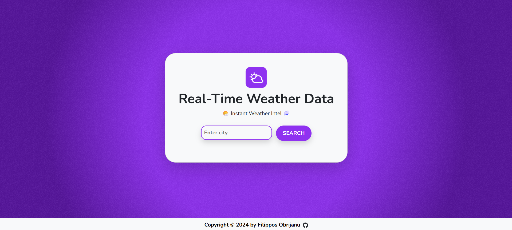
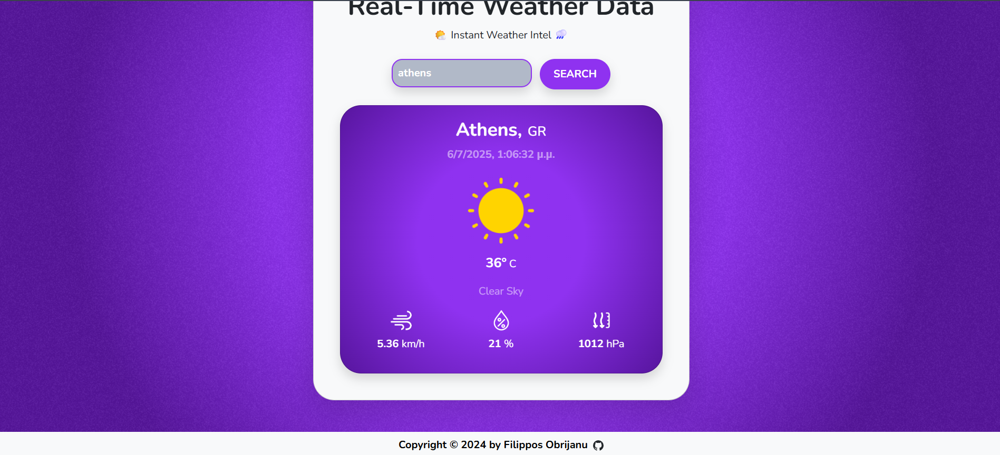

# 🌦️ Real-Time Weather Forecast System

A modern **web application** for accurate weather forecasting and city-based climate monitoring, built with **React.js**, **TimezoneDB API**, and **OpenWeatherMap API**. The system is deployed on **Netlify** for seamless global accessibility with real-time data updates.

---

## 🌟 Key Features

### 🔍 City Weather Search
- Detailed forecasts including:
- Current temperature (°C/°F)
- Humidity levels
- Wind speed and direction
- Atmospheric pressure

### ⏰ Timezone Integration
- Automatic local time detection for searched cities
- Sunrise/sunset times display
- Time-sensitive weather alerts

### 📊 Advanced Visualization
- Responsive design for all devices

---

## 🛠️ Technologies Used

- **Frontend**: React.js with Hooks
- **Weather Data**: OpenWeatherMap API
- **Timezone Data**: TimezoneDB API
- **UI Framework**: Bootstrap 5
- **Deployment**: Netlify (CI/CD)
- **Version Control**: GitHub

---

## 📄 License

This project is open-source.

---

## 🤝 Contributing

Pull requests are welcome! Please follow standard GitHub flow and keep the code clean and documented.

---

## 📬 Contact

For questions, contact me at [obrizanou@gmail.com](mailto:obrizanou@gmail.com) or open an issue.

