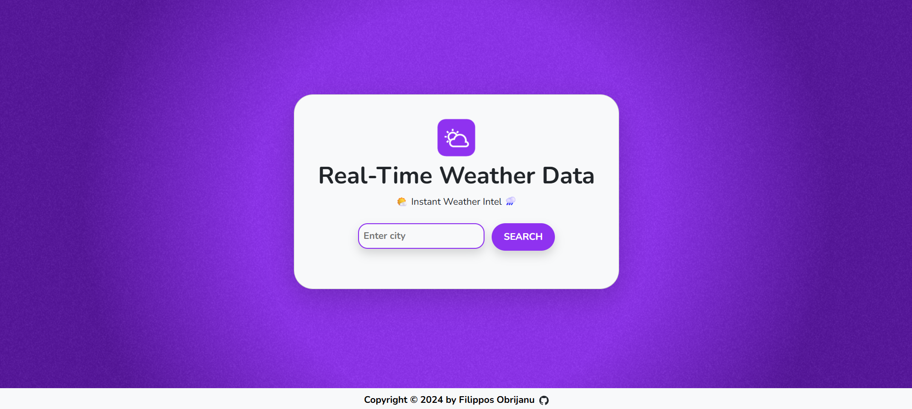
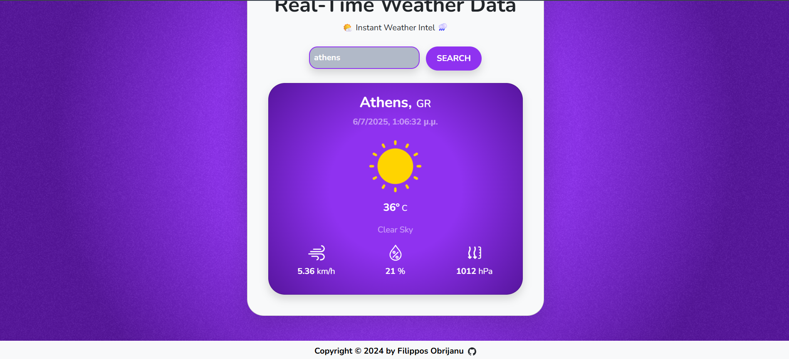

# Real-Time Weather Forecast System

[](https://weather-app-citycast.netlify.app/)
[](https://opensource.org/licenses/MIT)

A modern, responsive web application for real-time climate monitoring. This project integrates multiple third-party APIs to deliver live weather data and local time synchronization, providing users with a comprehensive view of global climate conditions.



## ✨ Core Features

* **Multi-API Integration:** Seamlessly aggregates data from OpenWeatherMap (climate data) and TimezoneDB (local time synchronization).
* **Detailed Analytics:** Provides high-fidelity weather metrics, including humidity, wind speed, atmospheric pressure, and sunrise/sunset calculations.
* **Smart Search & Local Time:** Automatically detects and displays local time for any searched city, ensuring time-sensitive data is always accurate.
* **Modern React Architecture:** Built with React Hooks (`useState`, `useEffect`) for efficient state management and component reusability.

## 🛠️ Built With

<p align="left">
  
  
  
  
</p>



## 🚀 Getting Started (Local Development)

1. **Clone the repository:**
```bash
   git clone [https://github.com/filipposobrijanu/Weather-App.git](https://github.com/filipposobrijanu/-Weather-App.git)
